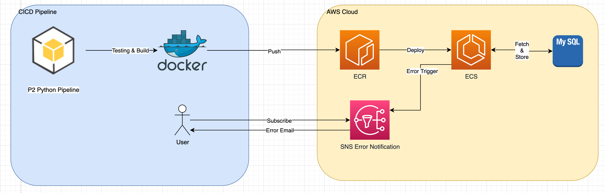

# Micron Interview Assignment Part2

The goal is to operationalize your model in Part 1 to run both inference and retraining pipelines

- You should use Python as main programming language to complete this exercise
- You may introduce various technology stack(s) to supplement your Python code as appropriately (as pseudocode), please share your reasons for doing so
- You can assume that the incoming new data will be available in the structured database readily
- Write the inference results in Part 1 into a structured database (preferably Microsoft SQL database)

Please summarize your thoughts on the following:

- Any anticipated pipeline exception/weaknesses and how you plan to handle these exceptions
- Your proposed monitoring metrics for the analytical pipeline health, as well as potential troubleshooting steps
- Any other pipeline components which will help to achieve MLOps

## Note



- Assume the solution to be dockerize and deploy to ECS.
- Assume AWS SNS will be configured for error email notification.
- Assume if running this in AWS ECS, console will be log to Cloud Logging mechanism. (Ex. CloudWatch). Local logging File can be ignored.
- The output of the step is storing in local tmp directory for debug purpose and serving as input for following step in mannual trigger mode during troubleshooting.

- Pipeline weakness.
  - No API inference. Can be code with Flask, Seldon Core, etc framework.
  - API security can leverage on AWS API Gatewory, Apigee etc
  - Can be further breakdown to multiple docker image and simplify unit of work.
  - Can be migrated to Cloud Framework - Sagemaker, GCP AI Vertex to have more robust logging and other supporting function.
    - Scalability. Can push the data processing to cloud big data platform for data processing. Ex. AWS EMR, Big Query etc
  - Additional Model Monitoring can be built. (Ex. MLFlow)
  - To cater of pipeline resume and debug. All function is storing intermidate result in local /tmp. Function can be invoke manually to resume operation.
  - To implmenet feature reduction after understandnig the feature in the future to speed up the whole pipeline.

- Monitoring Metrics
  - Procesing duration for each step will be captured for alert and pipeline health analytic
  - Processing status in each step
  - Data Stats such as row count, column count
  - Model Accuracy for retraining

- Troubleshooting
  - Added a error queue (AWS SNS topic) for error notification email subscription.
  - All exception will be caught and send to the AWS SNS Topic
  - Logging printed in console and log file.
  - Configure Log Rotation retain log file.
  - Pipeline step can be retrigger if it breaks. All intermediate result are stored in tmp directory and can be pickup in next step.
  - Pipeline's step can be retrigger with passing correct command arg
    - ex. `python -m p2.pipeline -log INFO -a data-check`

## Command

> Full Pipeline Trigger

```sh
cd <project_folder>/p2
python -m p2.pipeline -log INFO -a full-pipeline

# Check Log
less pipeline.log
```

> Manual Trigger

```sh
# Check Option
python -m p2.pipeline -h

# Ex. Data Checking
python -m p2.pipeline -log INFO -a data-check


```
